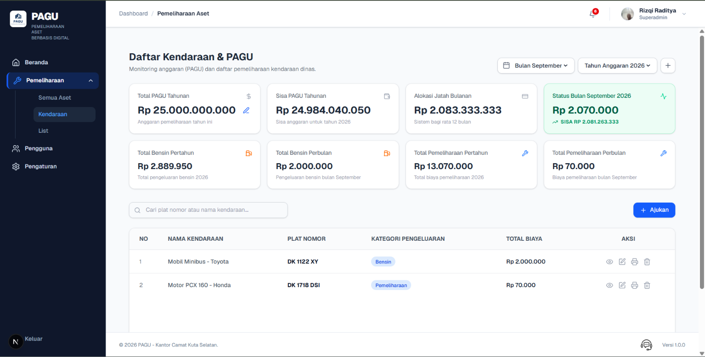

# 💰 PAGU — Sistem Manajemen Pagu dan Pemeliharaan Aset

**PAGU** adalah sistem informasi manajemen berbasis web yang dirancang untuk membantu instansi atau institusi dalam mengelola **Inventaris Aset (KIB B)**, mencatat **riwayat pemeliharaan**, serta memantau dan mengontrol **anggaran (Pagu)** secara terintegrasi.

Aplikasi ini membantu menggantikan proses pencatatan manual dengan sistem digital yang lebih terstruktur, sehingga data aset, riwayat pemeliharaan, serta penggunaan anggaran dapat dikelola dengan lebih mudah dan terdokumentasi.

🌐 **Live Website:** [Masukkan URL Vercel Anda]

📦 **Repository:** [Masukkan URL GitHub Anda]

---

## ✨ Fitur Utama

### 📦 Manajemen Inventaris (KIB B)

* 🏷️ **Pendataan Detail Aset**
  Mencatat informasi aset seperti nomor mesin, nomor rangka, BPKB, nomor polisi, merk/type, tahun pembelian, kondisi, dan informasi terkait lainnya.

* 📍 **Pemetaan Lokasi Aset**
  Menghubungkan aset dengan data ruangan atau lokasi untuk membantu mengetahui keberadaan fisik aset.

* 🔎 **Pencarian dan Filter**
  Mempermudah pencarian aset berdasarkan kategori, kondisi, tahun pembelian, lokasi, dan informasi lainnya.

---

### 🛠️ Manajemen Pemeliharaan

* 🔧 **Pencatatan Servis dan Perbaikan**
  Mencatat aktivitas pemeliharaan aset berdasarkan tanggal, jenis pemeliharaan, bengkel/rekanan, dan informasi terkait.

* 🧾 **Detail Biaya Pemeliharaan**
  Mencatat rincian pengeluaran seperti nama suku cadang, jumlah/unit, harga satuan, dan total biaya.

* 🚗 **Riwayat Pemeliharaan Kendaraan**
  Menyimpan histori perbaikan sehingga kondisi dan riwayat pemeliharaan kendaraan dapat ditelusuri kembali.

---

### 💸 Kontrol Pagu dan Anggaran

* 📈 **Dashboard Anggaran**
  Menampilkan informasi mengenai total pagu, total penggunaan anggaran, dan sisa anggaran.

* 📊 **Pemantauan Pengeluaran**
  Membantu memantau penggunaan anggaran berdasarkan transaksi pemeliharaan yang telah tercatat.

* 📅 **Alokasi Anggaran**
  Mendukung pemantauan penggunaan anggaran berdasarkan periode sehingga pengeluaran dapat lebih terkontrol.

---

### 📤 Export Data dan Pelaporan

* 📄 **Export PDF**
  Menghasilkan laporan atau dokumen pemeliharaan dalam format PDF yang siap dicetak.

* 🧾 **Cetak Nota Pemeliharaan**
  Menyediakan dokumen rincian biaya pemeliharaan yang dapat digunakan sebagai dokumentasi.

* 📊 **Export Excel**
  Mengekspor data inventaris dan rekapitulasi ke format Excel untuk kebutuhan administrasi dan pengolahan data lebih lanjut.

---

### 🔐 Keamanan dan Hak Akses

* 👥 **Role-Based Access Control**
  Membatasi akses pengguna berdasarkan role yang dimiliki.

* 🔒 **Authentication**
  Pengguna harus melakukan autentikasi sebelum mengakses fitur yang membutuhkan hak akses tertentu.

* 🛡️ **Perlindungan Data**
  Data sensitif seperti kredensial dan konfigurasi database disimpan menggunakan environment variables.

---

# 🛠️ Tech Stack

PAGU dibangun menggunakan teknologi berikut:

| Teknologi           | Penggunaan                              |
| ------------------- | --------------------------------------- |
| **Next.js**         | Framework aplikasi web                  |
| **React**           | Library antarmuka pengguna              |
| **TypeScript**      | Bahasa pemrograman                      |
| **Tailwind CSS**    | Styling dan layout                      |
| **shadcn/ui**       | Komponen antarmuka                      |
| **Headless UI**     | Komponen UI tambahan                    |
| **Supabase**        | Database PostgreSQL dan backend service |
| **jsPDF**           | Pembuatan dokumen PDF                   |
| **jsPDF AutoTable** | Pembuatan tabel pada PDF                |
| **XLSX**            | Export dan pengolahan file Excel        |
| **PapaParse**       | Pengolahan data CSV                     |
| **Lucide React**    | Icon library                            |
| **Vercel**          | Deployment                              |

---

# 📸 Screenshots

Berikut merupakan contoh tampilan antarmuka aplikasi **PAGU**.

### 🏠 Dashboard

Dashboard menampilkan informasi ringkas mengenai aset, anggaran, pemeliharaan, serta informasi penting lainnya.

<p align="center">
  
</p>

> **Catatan:** Simpan screenshot aplikasi di dalam folder `public/screenshots/` dan sesuaikan nama file pada README dengan nama file yang digunakan.

---

# 🚀 Instalasi

Ikuti langkah berikut untuk menjalankan PAGU secara lokal.

## 1. Clone Repository

Clone repository PAGU menggunakan Git:

```bash
git clone [URL_GITHUB_ANDA]
```

Masuk ke direktori project:

```bash
cd pagu
```

---

## 2. Install Dependencies

Install seluruh dependency yang diperlukan:

```bash
npm install
```

Jika dependency export belum tersedia, install dengan:

```bash
npm install jspdf jspdf-autotable xlsx papaparse
```

Kemudian install type definition untuk PapaParse:

```bash
npm install -D @types/papaparse
```

---

## 3. Konfigurasi Supabase

PAGU menggunakan **Supabase** sebagai database PostgreSQL dan backend service.

Jika package Supabase belum tersedia, install dengan:

```bash
npm install @supabase/supabase-js @supabase/ssr
```

---

## 4. Environment Variables

Buat file `.env.local` pada root project:

```text
.env.local
```

Kemudian masukkan konfigurasi Supabase:

```env
NEXT_PUBLIC_SUPABASE_URL=masukkan_url_supabase_anda
NEXT_PUBLIC_SUPABASE_ANON_KEY=masukkan_anon_key_supabase_anda
```

### ⚠️ Penting

Jangan pernah mengunggah file `.env.local` ke GitHub.

Pastikan `.env.local` sudah terdapat di dalam `.gitignore`:

```gitignore
.env*
```

Jangan membagikan credential atau secret database kepada orang lain.

---

# ▶️ Menjalankan Project

Setelah seluruh konfigurasi selesai, jalankan development server:

```bash
npm run dev
```

Kemudian buka browser dan akses:

```text
http://localhost:3000
```

Jika konfigurasi authentication telah diterapkan, pengguna yang belum login akan diarahkan ke halaman login.

---

# 🏗️ Build untuk Production

Untuk memastikan project dapat dibuild dengan baik, jalankan:

```bash
npm run build
```

Jika proses build berhasil, project dapat dijalankan menggunakan:

```bash
npm start
```

---

# 🌐 Deployment

PAGU dapat di-deploy menggunakan **Vercel**.

### 1. Install Vercel CLI

```bash
npm install -g vercel
```

### 2. Login

```bash
vercel login
```

### 3. Deploy

Untuk deployment production:

```bash
vercel --prod
```

### Environment Variables

Pastikan environment variables berikut telah ditambahkan pada **Vercel Project Settings**:

```env
NEXT_PUBLIC_SUPABASE_URL=masukkan_url_supabase_anda
NEXT_PUBLIC_SUPABASE_ANON_KEY=masukkan_anon_key_supabase_anda
```

---

# 📂 Struktur Project

Struktur project secara umum:

```text
pagu/
├── public/
│   └── screenshots/
│
├── src/
│   ├── app/
│   ├── components/
│   ├── lib/
│   └── ...
│
├── .env.local
├── .gitignore
├── package.json
├── tsconfig.json
└── README.md
```

Struktur dapat berubah mengikuti perkembangan aplikasi.

---

# 🎯 Tujuan Pengembangan

PAGU dikembangkan untuk membantu proses pengelolaan aset dan pemeliharaan menjadi lebih terstruktur melalui digitalisasi.

Beberapa tujuan utama aplikasi ini adalah:

* **Transparansi Anggaran**
  Membantu memantau penggunaan anggaran pemeliharaan berdasarkan data transaksi yang tercatat.

* **Data yang Tertelusur**
  Menyimpan riwayat pemeliharaan sehingga aktivitas perbaikan suatu aset dapat ditelusuri kembali.

* **Digitalisasi KIB B**
  Mengubah proses pencatatan inventaris dari metode manual menjadi sistem digital yang lebih mudah dicari dan dikelola.

* **Efisiensi Administrasi**
  Mempermudah proses pencatatan, pencarian, rekapitulasi, dan pembuatan laporan.

* **Pengelolaan Data Terpusat**
  Mengintegrasikan data aset, pemeliharaan, dan anggaran dalam satu sistem.

---

# 🔮 Pengembangan Selanjutnya

PAGU masih dapat dikembangkan lebih lanjut sesuai kebutuhan pengguna dan instansi.

Beberapa kemungkinan pengembangan:

* 📊 Dashboard analitik yang lebih lengkap
* 🔔 Notifikasi pemeliharaan aset
* 📅 Pengingat jadwal servis
* 📱 Peningkatan pengalaman penggunaan pada perangkat mobile
* 📈 Laporan dan analitik penggunaan anggaran
* 👥 Pengembangan role dan permission yang lebih detail
* 📝 Audit log aktivitas pengguna
* 🔗 Integrasi dengan sistem administrasi lainnya

---

# 🤝 Kontribusi

Kontribusi terhadap pengembangan PAGU sangat terbuka.

Jika ingin melakukan perubahan atau menambahkan fitur:

1. Fork repository.
2. Buat branch baru.

```bash
git checkout -b feature/nama-fitur
```

3. Lakukan perubahan yang diperlukan.
4. Commit perubahan.

```bash
git commit -m "feat: tambah nama fitur"
```

5. Push branch ke repository.

```bash
git push origin feature/nama-fitur
```

6. Buat Pull Request.

---

# 📄 License

Project ini dikembangkan sebagai aplikasi sistem informasi manajemen aset dan pemeliharaan.

Lisensi dapat disesuaikan dengan kebutuhan pemilik atau pengembang project.

---

## 👨‍💻 Developer

**PAGU Application**

Developed using **Next.js, TypeScript, Tailwind CSS, and Supabase**.

---

© 2026 PAGU Application. All rights reserved.
